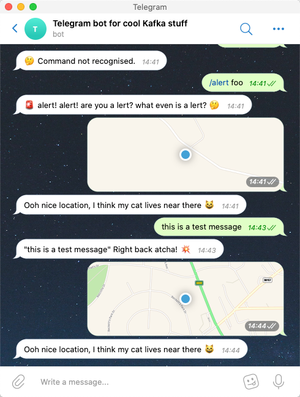

= golang-telegram-bot
Robin Moffatt <robin@moffatt.me>
v1.00, 29 July 2020

A sample telegram bot written in Go using the rather nice https://github.com/go-telegram-bot-api/telegram-bot-api[Golang library here]

== Setup

Send a `/newbot` message to http://t.me/botfather[Botfather] in Telegram to create your bot and put the resulting API token in `telegram_token.go` (see `telegram_token.go.example`).

== Run it

[source,bash]
----
go run .
----

== Sample ouput

[source,bash]
----
➜ go run .
2020/07/29 14:43:06 Authorized on account rmoff_telegram_bot
2020/07/29 14:43:14 [rmoff] this is a test message (command: false, location: <nil>)
2020/07/29 14:44:22 [rmoff]  (command: false, location: &{-1.581975 53.824302})
----

